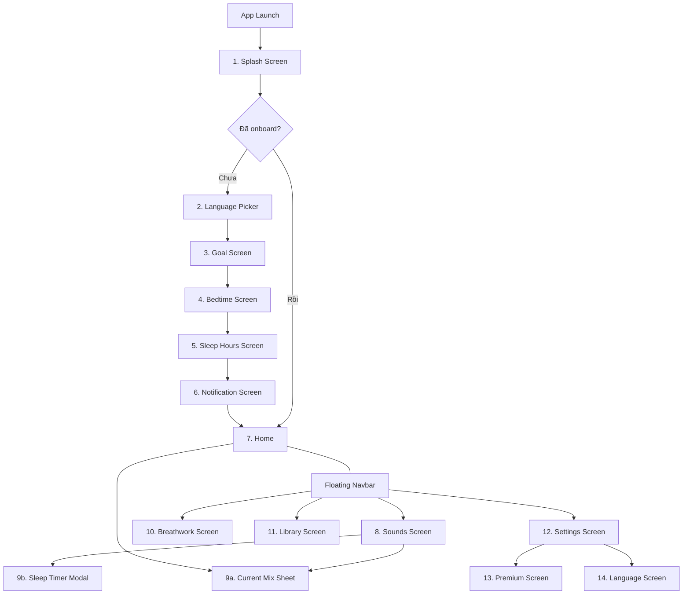

# Sleepify — Đặc Tả Màn Hình & Chức Năng

> Tài liệu tham chiếu cho toàn bộ luồng UI. Mỗi screen ghi rõ: layout, UI elements, interactions, navigation, dữ liệu, và flag premium.

---

## Quyết định đã thống nhất

| Hạng mục | Quyết định |
|----------|------------|
| Data source | **Local assets** (bundled trong app) |
| Audio files | User tự thêm files |
| Localization | **VN + EN** ngay từ đầu |
| Premium | Tất cả **free**, nhưng setup flag `isPremium` trên mỗi content/feature để lock sau |

---

## Tổng quan luồng đi



---

## Flow 1 — Onboarding (chạy 1 lần)

### Screen 1: Splash Screen

| Thuộc tính | Mô tả |
|------------|--------|
| **Route** | `/splash` |
| **Mục đích** | Branding, loading assets, check onboarding status |
| **Layout** | Full screen, centered |

**UI Elements:**
- Logo app (trăng lưỡi liềm + sao) — centered
- App name "**SLEEPIFY**" — bên dưới logo, font lớn, letter-spacing rộng
- Tagline "luxury sleep & breathwork" — caption nhỏ bên dưới
- Background: Midnight Navy gradient + particles/stars animation

**Interactions:**
- Auto-navigate sau 2-3s
- Nếu đã onboard → `/home`
- Nếu chưa → `/onboarding/language`

**Data:** Check `isOnboarded` flag từ local storage

---

### Screen 2: Language Picker

| Thuộc tính | Mô tả |
|------------|--------|
| **Route** | `/onboarding/language` |
| **Mục đích** | Chọn ngôn ngữ app |
| **Layout** | Header + scrollable list + bottom CTA |

**UI Elements:**
- Title: "Select Language"
- List ngôn ngữ, mỗi item:
  - Quốc kỳ (emoji hoặc icon) + Tên ngôn ngữ
  - Radio/check indicator khi selected
  - GlassCard style cho mỗi row
- Danh sách: English (UK), French, German, Japanese, Spanish, **Vietnamese** ✅, Italian, Korean
- **CTA Button**: "Continue" (full-width, Neon Cyan)

**Interactions:**
- Tap chọn ngôn ngữ → highlight selected
- Tap "Continue" → lưu ngôn ngữ + navigate `/onboarding/goal`
- Default selected: theo locale thiết bị (hoặc English)

**Data:** Lưu `locale` vào local storage. App reload với ngôn ngữ đã chọn.

---

### Screen 3: Goal Screen

| Thuộc tính | Mô tả |
|------------|--------|
| **Route** | `/onboarding/goal` |
| **Mục đích** | Thu thập mục tiêu sử dụng |
| **Layout** | Header + progress indicator + options + CTA |

**UI Elements:**
- Back button (top-left)
- Progress step indicator (top-right, ví dụ: step 1/4)
- Title: "What is your main goal **today**?" (bold "today")
- Subtitle: "Tell us your aspiration to be better well-being"
- 4 option cards (vertical list), mỗi card:
  - Icon (circle, neon cyan) + Label
  - **Sleep** 🌙, **Relax** 🧘, **Focus** 🎯, **Breathe** 🫁
  - Multi-select: tap toggle, selected = cyan border glow
- **CTA**: "CONTINUE" (disabled nếu chưa chọn)

**Interactions:**
- Multi-select (chọn 1 hoặc nhiều)
- Continue → `/onboarding/bedtime`
- Back → `/onboarding/language`

**Data:** `selectedGoals: List<String>`

**🔒 Premium flag:** Không áp dụng

---

### Screen 4: Bedtime Screen

| Thuộc tính | Mô tả |
|------------|--------|
| **Route** | `/onboarding/bedtime` |
| **Mục đích** | Thu thập giờ đi ngủ thường xuyên |
| **Layout** | Header + progress + options + CTA |

**UI Elements:**
- Back button + Progress (step 2/4)
- Title: "When do you usually sleep?"
- Subtitle: mô tả ngắn
- 4 option cards (single-select):
  - `9 PM - 10 PM`
  - `10 PM - 12 AM` ← default selected
  - `12 AM - 2 AM`
  - `After 2 AM`
- **CTA**: "Continue"

**Interactions:**
- Single-select (chỉ 1)
- Continue → `/onboarding/sleep-hours`

**Data:** `bedtimeRange: String`

---

### Screen 5: Sleep Hours Screen

| Thuộc tính | Mô tả |
|------------|--------|
| **Route** | `/onboarding/sleep-hours` |
| **Mục đích** | Thu thập nhu cầu giấc ngủ |
| **Layout** | Header + progress + slider + CTA |

**UI Elements:**
- Back button + Progress (step 3/4)
- Title: "How many hours of sleep do you need?"
- Subtitle: mô tả
- **Slider**: range 4h - 12h, step 0.5h
  - Hiển thị giá trị đang chọn (số lớn, bold)
  - Track color: Neon Cyan
- **CTA**: "Continue"

**Interactions:**
- Drag slider
- Continue → `/onboarding/notification`

**Data:** `desiredSleepHours: double`

---

### Screen 6: Notification Screen

| Thuộc tính | Mô tả |
|------------|--------|
| **Route** | `/onboarding/notification` |
| **Mục đích** | Xin quyền notification |
| **Layout** | Center illustration + text + CTA + skip |

**UI Elements:**
- Back button + Progress (step 4/4)
- Illustration: notification bell / clock icon (cyan glow)
- Title: "Get notified for better rest"
- Subtitle: "Enable this to set your sleep schedule, so you don't miss your perfect bedtime. We'll take charge."
- **Primary CTA**: "Enable Notifications" (Neon Cyan)
- **Secondary**: "I'll do it later" (text button, muted)

**Interactions:**
- "Enable Notifications" → request OS notification permission → save `true` → navigate `/home`
- "I'll do it later" → save `false` → navigate `/home`
- Lưu `isOnboarded = true`

**Data:** `notificationsEnabled: bool`, `isOnboarded: bool`

---

## Global Components

### Floating Navigation Bar

| Thuộc tính | Mô tả |
|------------|--------|
| **Vị trí** | Fixed bottom, edge-to-edge |
| **Style** | Minimal glassmorphism — blur backdrop, subtle top border, no capsule |
| **Tabs** | 5 icons — có label bên dưới |

**5 Tabs:**

| # | Label | Icon | Đặc biệt |
|---|-------|------|-----------|
| 1 | Home | 🏠 outline/fill | — |
| 2 | Sounds | 🔊 outline/fill | — |
| 3 | Breathwork | 🫁 outline/fill | — |
| 4 | Library | 📚 outline/fill | — |
| 5 | Settings | ⚙️ outline/fill | — |

**Interactions:**
- Tap → chuyển tab (giữ state mỗi tab via `IndexedStack`)
- Active tab: icon fill + Neon Cyan color + bold label
- Inactive: icon outline + muted 50% opacity

---

### Mini Player Bar

| Thuộc tính | Mô tả |
|------------|--------|
| **Vị trí** | Fixed, ngay **trên** Floating Navbar |
| **Hiển thị** | Chỉ khi có mix đang active |
| **Style** | GlassCard nhỏ, full-width (trừ padding) |

**UI Elements:**
- Tên mix / số lượng sounds active: "3 sounds playing"
- Play/Pause toggle button (Neon Cyan)
- Tap anywhere → mở `CurrentMixSheet`

---

## Flow 2 — Home

### Screen 7: Home Screen

| Thuộc tính | Mô tả |
|------------|--------|
| **Route** | `/home` (tab 1) |
| **Mục đích** | Main dashboard, content discovery |
| **Layout** | Scrollable, nhiều sections |

**UI Elements (top → bottom):**

**a. Top Bar:**
- Avatar user (circle, left)
- Greeting: "Good Evening, Alex" (dynamic theo thời gian: Morning/Afternoon/Evening)
- Notification bell icon (right)

**b. Hero Section:**
- GlassCard lớn, full-width
- Background image/gradient
- Title: "Deep Space Delta Waves" (ví dụ)
- Play button overlay
- Tag: category badge
- `🔒 isPremium: bool` — một số hero content có thể lock

**c. Quick Mood Chips (horizontal scroll):**
- Chips: Relax, Deep Sleep, Focus, Peaceful, ...
- Tap chip → filter content bên dưới
- Style: pill shape, cyan border khi selected

**d. Top 5 Section:**
- Header: "Top 5 Selection" + "See All" link
- Horizontal scroll cards, mỗi card:
  - Thumbnail image
  - Tên sound/mix
  - Duration
  - `🔒 isPremium: bool`

**e. Healing Ambient Section:**
- Header: "Healing Ambient"
- Horizontal scroll cards (hình vuông/tròn)
  - Thumbnail
  - Tên
  - `🔒 isPremium: bool`

**f. Bottom spacing** cho Navbar + MiniPlayer

**Interactions:**
- Tap Hero → play content (hoặc navigate detail)
- Tap Mood Chip → filter sections
- Tap card → add to mix hoặc play
- Pull down → refresh (nếu cần)

---

## Flow 3 — Sounds + Player

### Screen 8: Sounds Screen

| Thuộc tính | Mô tả |
|------------|--------|
| **Route** | `/sounds` (tab 2) |
| **Mục đích** | Browse & mix ambient sounds |
| **Layout** | Header + grid |

**UI Elements:**
- Title: "Relaxing Sounds"
- Category filter (optional): All, Nature, Urban, Music, ...
- **Sound Grid** (3-4 columns):
  - Mỗi item là circle icon
  - Icon ở center (emoji hoặc custom icon)
  - Label bên dưới: tên sound
  - **Inactive**: muted, no glow
  - **Active**: Neon Cyan circle glow + **Volume Ring** (circular progress xung quanh icon)
  - `🔒 isPremium: bool` — hiển thị lock icon nếu locked

**Interactions:**
- **Tap sound** → toggle active/inactive
  - Active: thêm vào current mix + start playback
  - Inactive: remove khỏi mix + stop
  - Animation: scale bounce + glow fade-in
- **Long press / drag Volume Ring** → điều chỉnh volume (0-100%) cho sound đó
- Khi có ≥1 sound active → MiniPlayerBar xuất hiện
- Tap MiniPlayerBar → mở `CurrentMixSheet`

**Data mỗi Sound:**
```
Sound {
  id: String
  name: String (localized)
  icon: String (asset path)
  category: String
  audioPath: String (local asset)
  isPremium: bool
}
```

---

### Screen 9a: Current Mix Sheet (Bottom Sheet)

| Thuộc tính | Mô tả |
|------------|--------|
| **Trigger** | Tap MiniPlayerBar hoặc swipe up |
| **Style** | DraggableScrollableSheet, glassmorphism |
| **Layout** | Header + sound list + controls |

**UI Elements:**
- Drag handle (top center)
- Greeting: "Good Evening, Alex"
- Section title: "Current Mix"
- **Sound list** — mỗi item:
  - Icon (active cyan glow)
  - Tên sound
  - Volume slider (horizontal, 0-100%)
  - Remove button (X)
- **Large Play/Pause button** (center, Neon Cyan circle)
- Info: "X sounds · mixing" status text
- **Save Mix** button (heart icon hoặc save icon)

**Interactions:**
- Adjust volume slider → real-time volume change
- Tap X → remove sound khỏi mix
- Tap Play/Pause → toggle playback
- Save Mix → lưu vào Library
- Swipe down → dismiss sheet

---

### Screen 9b: Sleep Timer Modal

| Thuộc tính | Mô tả |
|------------|--------|
| **Trigger** | Timer icon trên MiniPlayerBar hoặc CurrentMixSheet |
| **Style** | Modal bottom sheet, compact |
| **Layout** | Title + options + CTA |

**UI Elements:**
- Title: "Auto-Stop Timer"
- Time options (vertical list, GlassCard style):
  - 10 min / 15 min / 20 min / 25 min / 30 min / Custom
  - Selected = Cyan highlight
- **CTA**: "START TIMER ▶" (Neon Cyan)
- Khi timer đang chạy:
  - Hiển thị countdown (MM:SS)
  - Button đổi thành "CANCEL TIMER"

**Interactions:**
- Chọn thời gian → tap Start → bắt đầu countdown
- Khi hết giờ → fade out audio → stop playback
- Cancel → hủy timer

---

## Flow 4 — Breathwork

### Screen 10: Breathwork Screen

| Thuộc tính | Mô tả |
|------------|--------|
| **Route** | `/breathwork` (tab 3, center) |
| **Mục đích** | Guided breathing exercises |
| **Layout** | Full screen, centered visualizer |

**UI Elements:**

**a. Top:**
- Title: "Breathwork"
- Pattern selector dropdown/tabs: **Box Breathing**, 4-7-8, Relaxing
- Timer: "Counting 0:32.11" (elapsed time)

**b. Center — Breathing Visualizer:**
- Large circle animation (expand = inhale, contract = exhale)
- Text instruction inside: "**INHALE**" / "**HOLD**" / "**EXHALE**"
- Circle border: Neon Cyan glow, pulse animation
- Concentric rings radiating outward when breathing

**c. Bottom:**
- Play/Pause button (large, Neon Cyan)
- Session info (total duration, rounds completed)

**Breathing Patterns:**

| Pattern | Inhale | Hold | Exhale | Hold |
|---------|--------|------|--------|------|
| **Box Breathing** | 4s | 4s | 4s | 4s |
| **4-7-8** | 4s | 7s | 8s | 0s |
| **Relaxing** | 4s | 0s | 6s | 0s |

`🔒 isPremium: bool` — một số patterns có thể lock

**Interactions:**
- Tap Play → start breathing cycle animation + timer
- Tap Pause → pause
- Chọn pattern → reset + animation preview
- Optional: background ambient sound khi breathwork

---

## Flow 5 — Library

### Screen 11: Library Screen

| Thuộc tính | Mô tả |
|------------|--------|
| **Route** | `/library` (tab 4) |
| **Mục đích** | Saved mixes & bookmarked content |
| **Layout** | Tab bar + list |

**UI Elements:**

**a. Top:**
- Title: "My Library"
- Tab bar: **Saved** | **Mix** (hoặc Favorites | My Mixes)

**b. Content list** — mỗi item:
- Thumbnail (album art style, rounded square)
- Tên mix
- Metadata: "X sounds · created date"
- Play button (right side)
- Duration badge

**c. Empty state:**
- Illustration + "No saved mixes yet"
- CTA: "Browse Sounds"

**Interactions:**
- Tap item → play mix (load sounds, start playback)
- Swipe left → Delete option
- Long press → Edit mix name
- Tap Play button → immediate playback

---

## Flow 6 — Settings

### Screen 12: Settings Screen

| Thuộc tính | Mô tả |
|------------|--------|
| **Route** | `/settings` (tab 5) |
| **Layout** | Scrollable list |

**UI Elements:**

**a. Premium Banner (top):**
- "Sleepify Premium" text
- "UPGRADE NOW" button (gold/yellow accent)
- Nếu đã premium → ẩn banner

**b. Settings Items** (GlassCard sections):

| Item | Type | Mô tả |
|------|------|--------|
| Sleep Reminder | Time picker | Giờ nhắc đi ngủ |
| Notifications | Toggle | Bật/tắt notifications |
| Language | Navigation → LanguageScreen | Hiển thị ngôn ngữ hiện tại |
| App Sounds | Toggle | Âm thanh UI |
| Dark Mode | Toggle (always on) | Luôn dark |
| Rate App | Link | Mở store |
| Help & Support | Link | FAQ / contact |
| Privacy Policy | Link | Web view |
| About | Info | Version, credits |

**Interactions:**
- Tap item → toggle / navigate / open link
- Tap Premium banner → `/premium`

---

### Screen 13: Premium Screen

| Thuộc tính | Mô tả |
|------------|--------|
| **Route** | `/premium` |
| **Layout** | Full screen, scroll |

**UI Elements:**
- Close button (X, top-left)
- "Restore" link (top-right)
- **Hero illustration**: Crown icon (gold, 3D style)
- Title: "Unlock Deepest Sleep"
- Feature list (checkmarks):
  - ✅ Unlock Sounds (80+ sleep sounds)
  - ✅ Unlock Meditation (guided sessions)
  - ✅ Unlock All Breathing Patterns
  - ✅ Ad-free experience
- **Price card**: "$59.99 / year" (hoặc VND tùy locale)
  - Monthly option alternate
- **CTA**: "START 7-DAY FREE TRIAL" (full-width, gold/yellow)

**Note:** UI-only cho MVP. Không integrate payment thực tế.

**Interactions:**
- Tap CTA → show "Coming Soon" hoặc no-op
- Tap X → pop/dismiss

---

### Screen 14: Language Screen (trong Settings)

| Thuộc tính | Mô tả |
|------------|--------|
| **Route** | `/settings/language` |
| **Layout** | Giống Screen 2 (Language Picker) |

**Khác biệt vs Onboarding:**
- Có back button (app bar)
- Thay đổi ngôn ngữ → reload app ngay lập tức
- Không có "Continue" button — chọn = apply ngay

---

## Data Models Tổng Hợp

| Model | Fields | Ghi chú |
|-------|--------|---------|
| `Sound` | id, name, icon, category, audioPath, isPremium | Local asset |
| `Mix` | id, name, sounds[], createdAt | Saved by user |
| `PlayerState` | isPlaying, activeSounds[], volumes{} | Runtime state |
| `SleepTimerState` | isActive, duration, remaining | Runtime state |
| `BreathPattern` | name, inhale, hold1, exhale, hold2, isPremium | Predefined |
| `UserPreferences` | goals[], bedtime, sleepHours, notificationsEnabled, locale, isOnboarded | Local storage |

---

## Premium Lock Strategy

Mọi content/feature đều có field `isPremium: bool`:
- `isPremium = false` → Free, hiển thị bình thường
- `isPremium = true` → Hiển thị lock icon overlay, tap → show Premium paywall

**Lockable items:**
- Individual `Sound` items
- `BreathPattern` patterns
- Hero content trên Home
- Top 5 / Healing Ambient items

**Luôn free:**
- Toàn bộ UI navigation
- Basic sounds (ít nhất 5-6 sounds free)
- Box Breathing pattern
- Library (save/load)
- Settings
- Onboarding

---

## Localization (i18n)

Hỗ trợ: **Vietnamese** 🇻🇳 + **English** 🇬🇧

**Cách tiếp cận:**
- Sử dụng package `flutter_localizations` + `intl` + ARB files
- Mỗi string UI đều qua localization (không hardcode)
- Locale lưu trong `UserPreferences`
- Có thể đổi bất cứ lúc nào trong Settings

**Files:**
```
lib/l10n/
├── app_en.arb    # English strings
├── app_vi.arb    # Vietnamese strings
└── l10n.yaml     # Config
```
